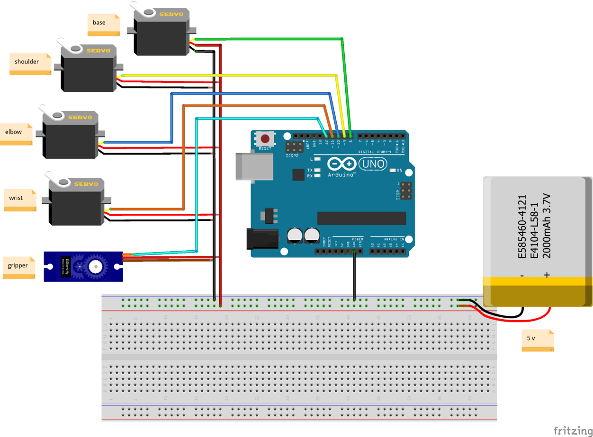

# arduino_robot_arm
ROS packages that can be used to plan and execute motion trajectories for a robot arm in simulation and real-life.

These packages were tested under ROS kinetic and Ubuntu 16.04
The robot arm uses Moveit plugin to apply kinematics by the KDL solver. These packages can be tested in the gazebo simulation tool and the real robot arm, where the ROS system and Arduino code share the ```/joint_states``` topic to control motors.
 
## Robot Arm
The robot arm has 5 joints only 4 joints can be fully controlled via ROS and Rviz, the last joint (gripper) has a default motion executed from the Arduino code directly.
### Circuit diagram 

### Robot initial positions


## Usage
### Controlling the robot arm by joint_state_publisher
```$ roslaunch robot_arm_pkg check_motors.launch```
You can also run this instruction to connect with hardware:
```$ rosrun rosserial_python serial_node.py _port:=/dev/ttyUSB0 _baud:=115200```
(Note: You may need to use ttyACM)

### Controlling the robot arm by Moveit and kinematics
```$ roslaunch moveit_pkg demo.launch```
You can also run this instruction to connect with hardware:
```$ rosrun rosserial_python serial_node.py _port:=/dev/ttyUSB0 _baud:=115200```
(Note: You may need to use ttyACM)

or you just need to run the below instruction to use gazebo simulation
```$ roslaunch moveit_pkg demo_gazebo.launch```
